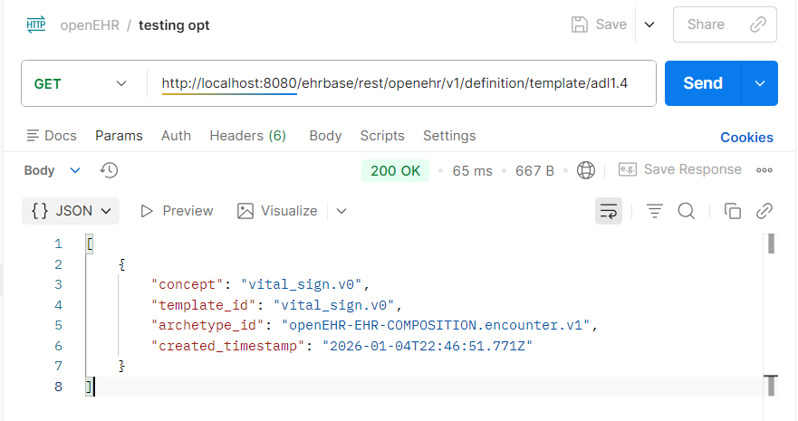
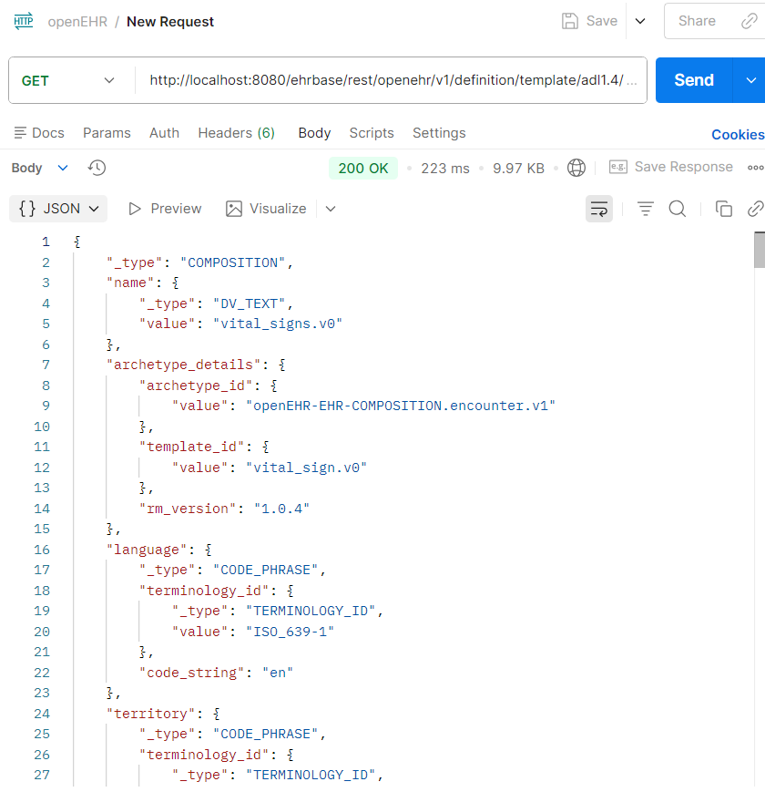
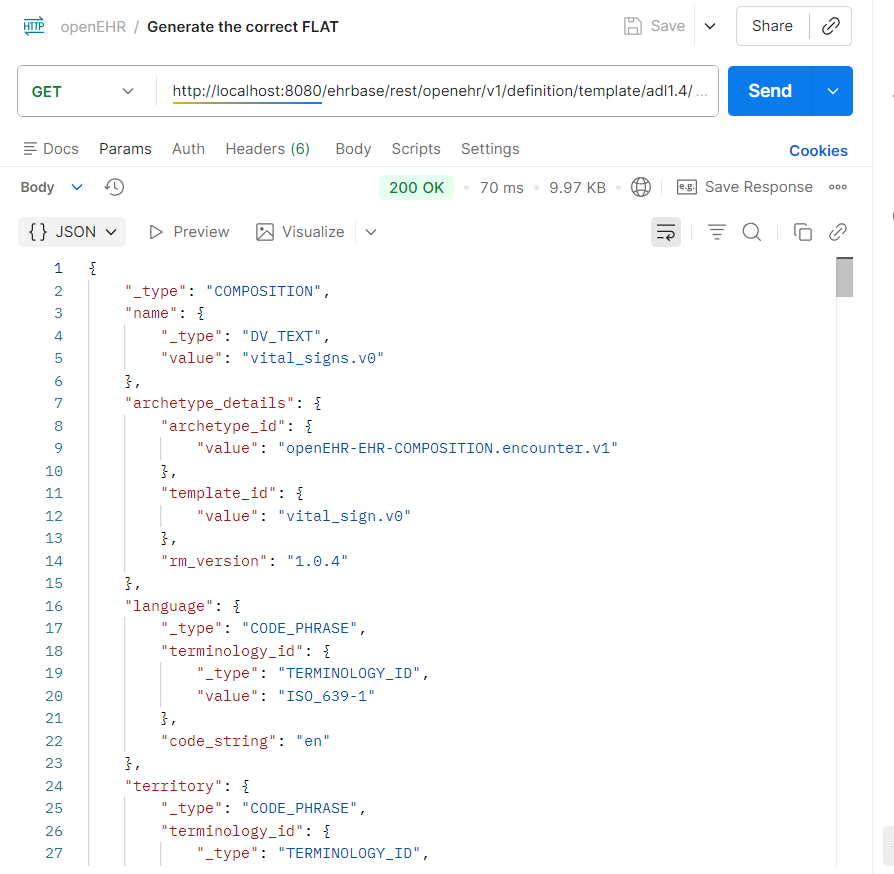
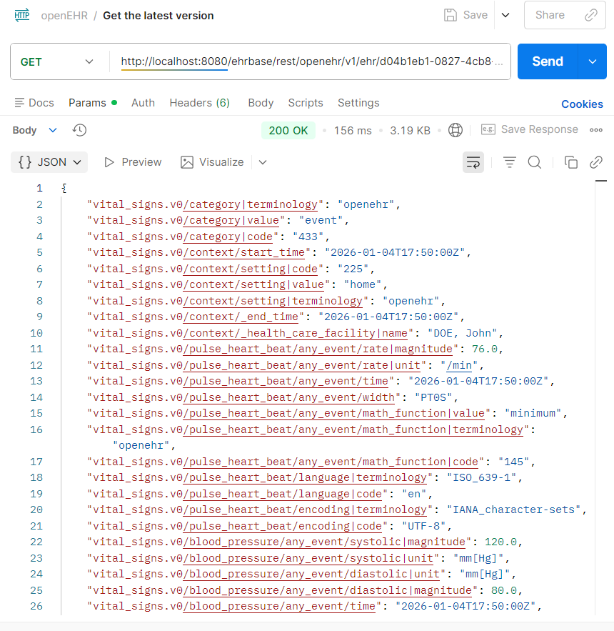
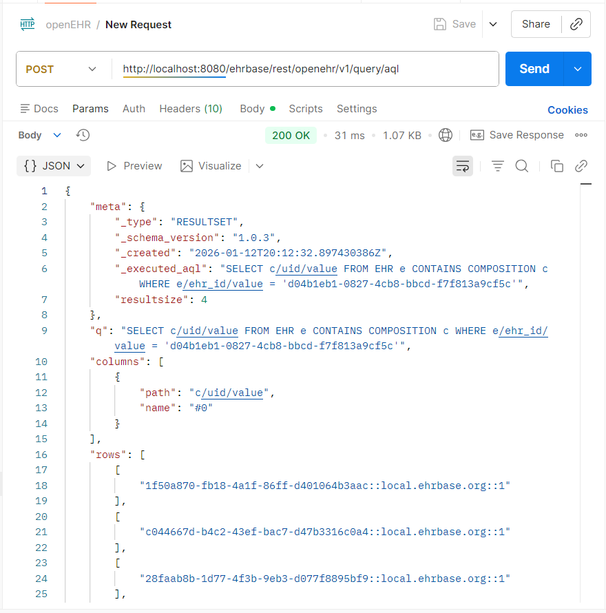
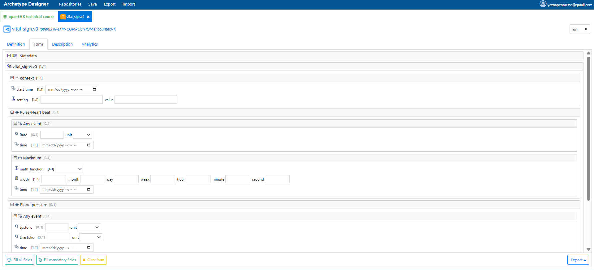
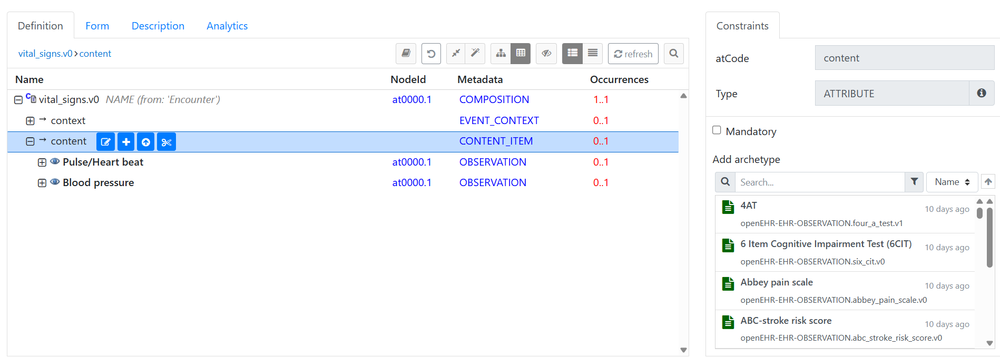

# openEHR Vital Signs Project  
(EHRbase · Templates · Postman · AQL)

This repository contains an end-to-end **openEHR Vital Signs implementation** built using **EHRbase**, **custom openEHR templates**, **Postman**, and **AQL (Archetype Query Language)**.

The project demonstrates how structured clinical data is modeled, stored, retrieved, and queried in an openEHR-based system, following real-world healthcare data standards.

---

## Project Goal

The goal of this project was to build a complete **Vital Signs clinical workflow** using openEHR, covering:

- Template-based clinical data modeling  
- Backend deployment using EHRbase  
- Posting clinical data as openEHR compositions  
- Querying stored data using AQL  

This mirrors how modern EHR systems manage structured clinical information.

---

## Clinical Scope

The project models and manages the following **Vital Signs**:

- **Pulse / Heart Rate**
- **Blood Pressure**
  - Systolic
  - Diastolic

These observations are defined using openEHR archetypes and combined into a single **Vital Signs template**.

---

## Technology Stack

- openEHR  
- EHRbase (Dockerized openEHR backend)  
- Archetype Designer  
- Postman  
- AQL (Archetype Query Language)  
- Docker  

---

## Repository Structure

openEHR-vital-signs/
│
├── 01_concepts/
├── 02_setup/
├── 03_templates/
├── 04_compositions/
├── 05_queries/
└── screenshots/


---

## Implementation Workflow

### 1. EHRbase Deployment

EHRbase was deployed locally using Docker and verified through its REST API.



---

### 2. Vital Signs Template Creation

A reusable **Vital Signs template** was created using Archetype Designer by assembling pulse and blood pressure archetypes and uploaded to EHRbase.



---

### 3. Posting a Vital Signs Composition

Clinical data was posted to EHRbase as an openEHR **COMPOSITION** using the **FLAT JSON format**.

A successful POST returned:

HTTP 204 No Content



---

### 4. Composition Retrieval (FLAT)

The stored composition was retrieved in FLAT format to verify that pulse and blood pressure values were correctly persisted.



---

### 5. Querying Data Using AQL

AQL (Archetype Query Language) was used to query structured clinical data stored in EHRbase.

```sql
SELECT
  c/uid/value AS comp_uid,
  o/data[at0002]/events[at0003]/data[at0001]/items[at0004]/value/magnitude AS pulse_rate,
  bp/data[at0001]/events[at0006]/data[at0003]/items[at0004]/value/magnitude AS systolic_bp,
  bp/data[at0001]/events[at0006]/data[at0003]/items[at0005]/value/magnitude AS diastolic_bp
FROM EHR e
CONTAINS COMPOSITION c
CONTAINS (
  OBSERVATION o[openEHR-EHR-OBSERVATION.pulse.v2]
  AND OBSERVATION bp[openEHR-EHR-OBSERVATION.blood_pressure.v2]
)
WHERE e/ehr_id/value = '<EHR_ID>'



**### 6. Composition Listing and Versioning**

Multiple compositions were created and verified using AQL queries.





### Key Outcomes

Implemented a complete openEHR-based Vital Signs workflow

Designed and uploaded a reusable clinical template

Stored structured clinical data using openEHR compositions

Queried clinical data using AQL

### Notes

No patient-identifiable data is included

Composition UIDs are system-generated by EHRbase

AQL queries are read-only


---

## ✅ That is it. Nothing else.

You do **NOT** paste multiple things.  
You do **NOT** combine blocks.  
You do **NOT** choose between versions.

👉 **Just paste that one block once.**

If you want, after you commit it, send me a message like:  
**“README updated”** and I’ll confirm it’s correct.
